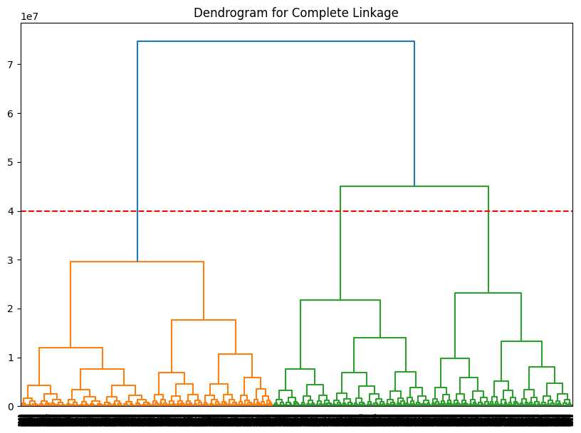
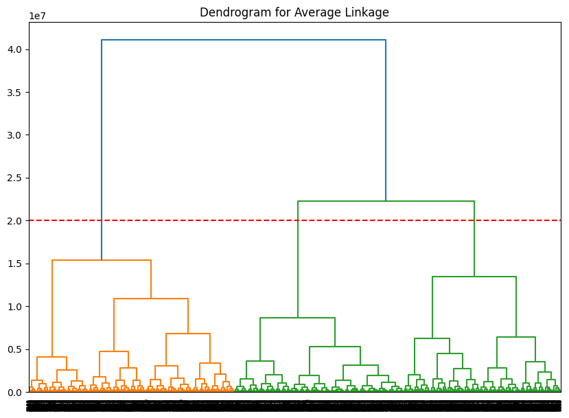
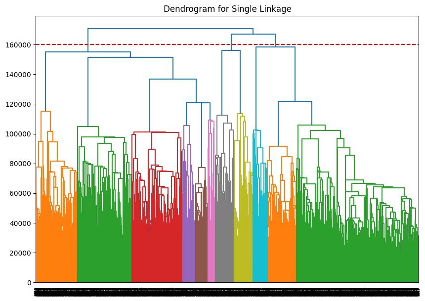
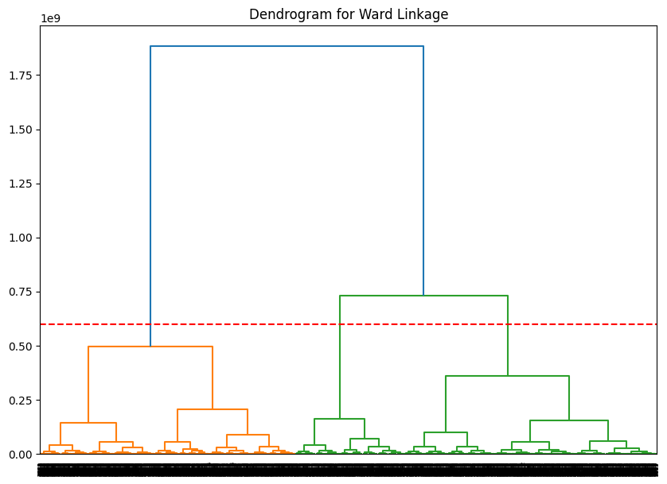
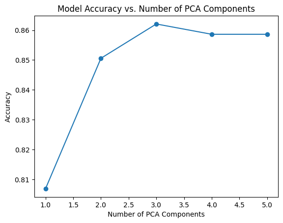
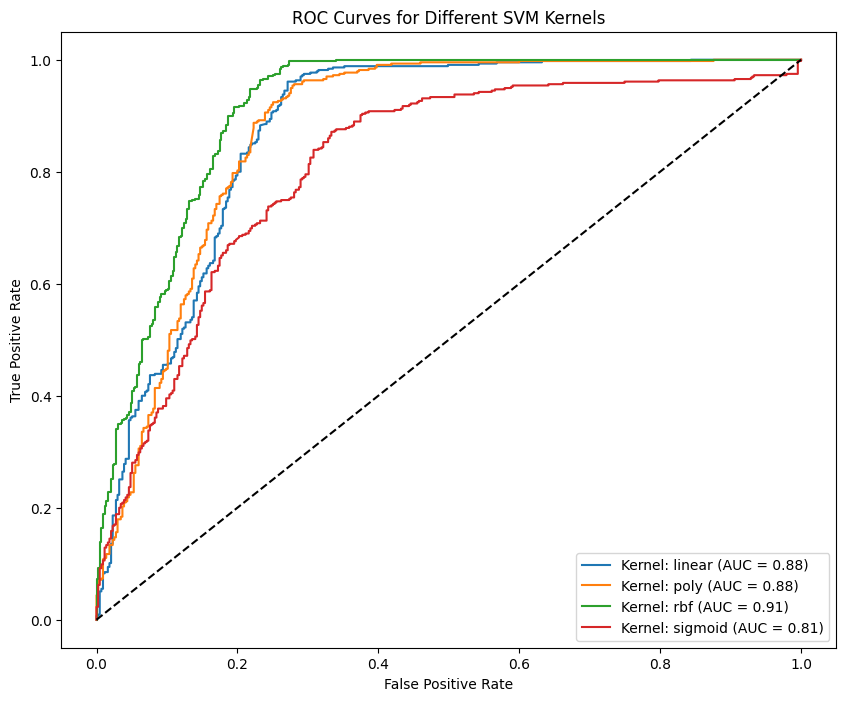

# Introduction
In the quest for understanding and safeguarding our planet from potential cosmic threats, the analysis of Near-Earth Objects (NEOs) takes center stage. Leveraging data from NASA's API on NEOs, this report delves into the development of machine learning models aimed at classifying these celestial entities as hazardous or non-hazardous. The urgency of this research lies in the profound implications of a collision with a hazardous NEO, as evidenced by historical cosmic events. By harnessing the power of machine learning, we aspire to enhance our predictive capabilities and contribute to the broader field of planetary defense

# Data Selection
This data is slightly pre-cleaned and obtained through NASA APIs obtained through the Center for Near Earth Object Studies which is responsible for computing highly accurate orbital data for thousands of asteroids and comets that fly close to our planetary neighborhood. This cleaned version is available on Kaggle under public domain provided by Mr. Sameep Vani, and it was last updated in June 2022.
[NASA NEO (Near-Earth Object) Dataset](https://www.kaggle.com/datasets/shivd24coder/nasa-neo-near-earth-object-dataset)

# Data Preprocessing
After performing Data Exploration we came to the conclusion to firstly:
  - some columns offer uninformative information. These columns are mainly `orbiting_body` and `sentry_object` as they have no variability at all.

Other columns we want to exclude will be the `name` and `id` as they are not even features, rather identifiers for the objects.
  -also see that our data is imbalanced, as we have the non-hazardous class dominating the dataset. so we balanced our dataset.

## Under-sampling
In this process, we aim to balance our dataset, which contains two classes of data: hazardous and non-hazardous. The goal is to achieve a dataset where these two classes are represented equally. To accomplish this, we first remove any duplicate entries based on the id field , ensuring each data point is unique. We then divide the data into hazardous and non-hazardous groups. We keep all hazardous samples (assuming they are less in number, about 20% of the dataset) and setting the number of non-hazardous samples to match the number of hazardous samples directly. This calculation involves determining the final desired dataset size and adjusting the non-hazardous sample count accordingly, ensuring it doesn't exceed the number of hazardous observations. We then sample the non-hazardous data  to match this calculated number, combining it with the hazardous data and shuffling to ensure a balanced mix . Finally, the balanced dataset is saved, ready for further analysis or model training. This methodology provides a clear and reproducible approach to achieving a balanced dataset.

# Unsupervised Models
## Principal Component Analysis (PCA)
The key insights:

-Once we look at the results we can see the first two principal components (PC1 and PC2) capture a significant amount of information (79.76% of the total variance). This suggests that these two components largely summarize the variability in our dataset
- Based on the cumulative proportion of variance, one can decide how many principal components to retain. For instance, using the first four components (capturing 100% of the variance) would be a comprehensive representation of the data.
-The negligible variance explained by PC5 suggests that it contributes little to the data structure and can be dropped without much loss of information.

## Clustering
### Hierarchical Clustering
Dendrograms for each hierarchical model were visualized, displaying the hierarchical structure of the data and the formation of clusters as the linkage threshold increases

Dendogram `Complete` Linkage

Dendogram `Average` Linkage

Dendogram `Single` Linkage

Dendogram `Ward`Linkage

These Dendograms Suggest that three clusters might be optimal which can be used for choosing parameter `k` when using K-Means clustering in further analysis

# Model Development

## Decision Trees
The first of a few models we will be tried was a simple Decision Tree with `max_depth=2`
The model demonstrated a high sensitivity rate of 97%, signifying its adeptness in accurately identifying hazardous objects. This attribute is particularly vital in the context of planetary defense, where the primary objective is to minimize the risk of overlooking potentially dangerous NEOs.

In essence, the decision tree model exhibits a pronounced capability in identifying hazardous objects, with a preferential error mode towards overestimation of risk. While the model demonstrates slightly lower specificity and precision, its exceptional sensitivity is of paramount importance in the realm of planetary defense against NEOs. This model orientation towards safety underscores its utility in applications where the cost of missing a hazardous object far outweighs the inconvenience of false alarms.
### Improvements
We noticed that initially, the tree is too focused on one feature, so we experimented with a few things to increase the model depth, and using more complex models such as Random Forest but none of the methods we tried yielded any improvements except for increasing model complexity, with a very slight improvement in specificity,
#### Hyperparameter Tuning
 We found the optimal depth by iterating over a range of possible tree depths and evaluating the performance of a decision tree classifier at each depth using cross-validation.

After testing all possible depths, we identify the optimal depth as 4 as it's the one that yields the highest cross-validation accuracy. This depth is considered optimal because it balances the model's ability to learn from the data without fitting excessively to the training set noise, thus acting as a form of model complexity control, akin to pruning.
### Decision Tree with PCA
once we found the optimal depth for the tree we applied a decision tree classifier in conjunction with Principal Component Analysis (PCA) to reduce dimensionality, we observed the following accuracies based on the number of PCA components used:

- Accuracy with 1 component: 0.8069
- Accuracy with 2 components: 0.8506
- Accuracy with 3 components: 0.8621
- Accuracy with 4 components: 0.8586
- Accuracy with 5 components: 0.8586

These results indicate that using 3 PCA components yields the highest accuracy, suggesting an optimal balance between dimensionality reduction and model performance. Further increasing the number of components does not significantly enhance accuracy, highlighting the effectiveness of PCA in identifying the most informative features for the decision tree model.
## Support Vector Machine (SVM)

After training the models, the performance is evaluated using metrics like accuracy, precision, recall, F1 score, and AUC (Area Under the Curve). These metrics provide a comprehensive view of the model's performance. The ROC (Receiver Operating Characteristic) curves for each kernel are plotted to visualize their performance in distinguishing between the classes. Finally, a bar plot compares the performance metrics across different kernels, helping to identify which kernel performs best on this dataset.

| Kernel  | Accuracy | F1 Score | AUC      |
|---------|----------|----------|----------|
| linear  | 0.837931 | 0.853278 | 0.876694 |
| poly    | 0.816092 | 0.840954 | 0.876951 |
| rbf     | 0.859770 | 0.874227 | 0.912818 |
| sigmoid | 0.740230 | 0.730952 | 0.811949 |

#### SVM Results:

-Radial Kernel: Highest accuracy and AUC, indicating excellent overall performance and ability to distinguish between classes.

-Linear Kernel: Close second in performance, showing good balance and effectiveness.

-Polynomial Kernel: Moderate performance, slightly behind the radial kernel.

-Sigmoid Kernel: Lowest performance, indicating it might not be the best fit for this particular dataset.

# Conclusion

## Key Findings

This study, focusing on the classification of Near-Earth Objects (NEOs) as hazardous or non-hazardous using machine learning techniques, has yielded several significant insights:

1. **Data Handling and Balance**: The dataset, sourced from NASA's API and pre-cleaned by Mr. Sameep Vani, was effectively balanced using under-sampling techniques. This step was crucial to ensure fair representation of both classes in the predictive models.

2. **Feature Analysis and Engineering**: The exclusion of non-variability features such as `orbiting_body` and `sentry_object`, and identifiers like `name` and `id`, refined the dataset for more effective modeling.

3. **Dimensionality Reduction with PCA**: PCA was applied to reduce the dataset to its most significant components. This step helped in simplifying the models without substantial loss of information.

4. **Hierarchical Clustering Insights**: Different linkage methods in hierarchical clustering provided an understanding of data structure.

5. **Model Development and Comparison**:
   - The **Decision Tree** model showed high sensitivity, crucial for detecting hazardous NEOs. However, it initially focused heavily on a single feature, leading to experiments with increased model complexity.
   - **Random Forests** and hyperparameter tuning offered minimal improvements over the decision tree model.
   - **Hyper Parameter Tuning** Found optimal depth by  iterating over a range of possible tree depths and evaluating the performance of a decision tree classifier at each depth using cross-validation.
   - **Support Vector Machines (SVM)** with different kernels were evaluated, with the radial kernel showing the highest accuracy and AUC.

6. **Performance Evaluation**:
    In terms of sensitivity (true positive rate), the decision tree model was particularly notable, emphasizing its potential in planetary defense scenarios where missing a hazardous NEO is more critical than false alarms.

## Overall Implications

In conclusion, this research contributes valuable insights into the classification of NEOs, offering a robust framework for further exploration and development in the realm of planetary defense. The methodologies and findings can be leveraged to enhance predictive capabilities, ultimately aiding in safeguarding our planet from potential cosmic threats.

